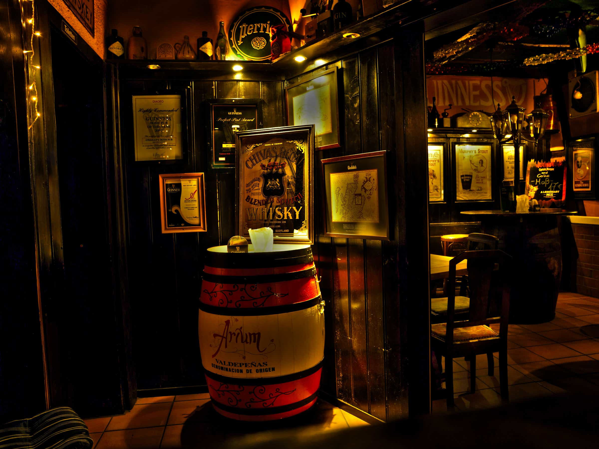

# PUB API



### Descrição do projeto:

O projeto trata de uma API rest que busca auxiliar um widget de cardápio eletrônico de PUB. As rotas representam os possíveis produtos que a PUB pode disponibilizar para seus clientes, sendo opcionais o uso de qualquer rota. Todas as rotas têm as operações CRUD completas (CREATE, READ, UPDATE, DELETE), apoiando-se nos padrões DAO para se comunicar com o banco de dados, e MVC para arquitetura e flow dos dados.

### Como utilizar a API:

O ambiente de desenvolvimento da API teve como suporte as ferramentas: VSCode, NodeJS e NPM.
Para executar o projeto dentro com esses suportes, baixe e instale o NodeJS, o VSCode e verifique se com a instalaçao dessa ferramenta o NPM já esteja executando através do comando

```Javascript
npm --version
```

A resposta deve trazer a versão instalada do NPM.

Feito isso, deve seguir os seguintes passos:

- Baixe este repositório ou clone através do Git Bash.
- Acesse a pasta gerada pelo método escolhido.
- Instale as dependências necessárias para o projeto através do comando:

```javascript
npm install
```

- após a instalação das dependências, rode a API com o comando:

```javascript
npm start
```

### Rotas da API:

Atualmente a API possui 5 rotas:

- bebidas - a entidade representada por essa rota possui as seguintes propriedades:

  ```javascript
  {
      id: integer,
      nome: string,
      sabor: string,
      embalagem: string,
      ml: float,
      preco: float
  }

  ```

- combos - a entidade representada por essa rota possui as seguintes propriedades:
  ```Javascript
  {
      id: integer,
      nome: string,
      quantidade: integer,
      valor: float
  }
  ```
- petiscos - a entidade representada por essa rota possui as seguintes propriedades:

  ```javascript
  {
      id: integer,
      nome: string,
      preco: float,
      tamanho: string
  }

  ```

- drinks - a entidade representada por essa rota possui as seguintes propriedades:

  ```javascript
  {
      id: int,
      nome: string,
      sabor: string,
      preco: float
  }

  ```

- lanches - a entidade representada por essa rota possui as seguintes propriedades:
  ```javascript
  {
      id: integer,
      nome: string,
      sabor: string,
      preco: float
  }
  ```

#### Os métodos de atualização, leitura, criação e deleção dos itens são padronizados e seguem os seguintes exemplos:

- Leitura da rota:
  basta escrever o endereço da API com o nome da entidade no endpoint. Exemplo:

```javascript
"http://localhost:3000/bebidas";
```

- Para ler apenas um produto da tabela, utilize o id como parâmetro. Exemplo:

```javascript
"http://localhost:3000/bebidas/1";
```

- Caso queira filtrar o resultado pela coluna, é possível também:

```javascript
"http://localhost:3000/bebidas/embalagem/lata";
```

- Para deletar um item é necessário indicar o id como parâmetro:

```javascript
"http://localhost:3000/bebidas/1";
```

- O mesmo vale para atualizar:

```javascript
"http://localhost:3000/bebidas/1";
```

### A API também pode ser utilizada via link, pela plataforma heroku:
o link de acesso [aqui](https://barzindofrances2.herokuapp.com/)


# Ferramentas utilizadas:

  * [node express](https://www.npmjs.com/package/express)
  * [fastest-validator](https://www.npmjs.com/package/fastest-validator)
  * [nodemon](https://www.npmjs.com/package/nodemon)
  * [sqlite3](https://www.npmjs.com/package/sqlite3)
  * [sqlite](https://www.npmjs.com/package/sqlite)
  * [chalk](https://www.npmjs.com/package/chalk)
  * [cors](https://www.npmjs.com/package/cors)